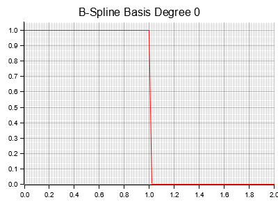

# bsfun

## Basis Spline Fun(ctions)

This is a super simple Rust library for working with basis splines and [NURBS (Non-Uniform Rational B-Splines)](https://en.wikipedia.org/wiki/Non-uniform_rational_B-spline) with zero dependecies (besides `alloc::Vec`).

These five basic functions are used in `NURBSCurve` and `NURBSSurface` evaluation:

1. `bspline_basis()` Calculate the value of a basis spline at a given `t`. This is the basic building block for all splines and the rational basis functions.
2. `rational_bspline_basis_curve()` Calculate the value of a rational basis spline for curves at a given `t`
3. `rational_bspline_basis_surface()` Calculate the value of a rational basis spline for surfaces at a given value pair `(u, v)`
4. `nurbs_curve_point()` Calculate the value of a NURBS curve at a given value `t`
5. `nurbs_surface_point()` Calculate the value of a NURBS surface at a given value pair `(u, v)`

You could use `1`, `2` and `3` to build your own Splines. `4` and `5` are just functions for calculating the value of a NURBS curve or surface for a set of parameters directly.

> Caution: `4` and `5` are mostly for playing around and will not validate parameters for you. You have to make sure that the parameters are in the correct range and of correct shape yourself. If you don't want that use the structs `NURBSCurve` and `NURBSSurface` and their `eval()` methods

Since this library does not have enhanced functionality beyond curve evaluations, you may want to use a more practical NURBS implementation from e.g. the library `truck`.

## Visualization of B-Spline Basis Functions
Degree: k    
Number of control points: n + 1  
Number of knots: n + 1 + k

$$
Knots \quad t_{i} < t_{i+1} \quad \text{for } i = 0, \dots, n + k
$$
$$
\begin{align*}
B_{i, 0}(x) = \begin{cases}
1 & \text{if } t_i \leq x < t_{i+1} \\
0 & \text{otherwise}
\end{cases}
\\
B_{i, k(x) = \frac{x - t_i}{t_{i+k} - t_i} B_{i, k-1}(x) + \frac{t_{i+k+1} - x}{t_{i+k+1} - t_{i+1}} B_{i+1, k-1}(x)}
\end{align*}
$$

made with [plotters](https://github.com/plotters-rs/plotters)

