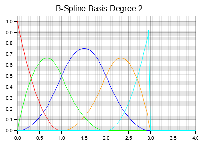

# bsfun

## Basis Spline Fun(ctions)

This is a super simple Rust library for working with basis splines and NURBS (Non-Uniform Rational B-Splines).

It consists of only four functions:

1. `bspline_basis()` Calculate the value of a basis spline at a given `t`
2. `rational_bspline_basis()` Calculate the value of a rational basis spline at a given `t`
3. `nurbs_curve_point()` Calculate the value of a NURBS at a given value `t`
4. `nurbs_surface_point()` Calculate the value of a NURBS surface at a given value pair `(u, v)`

## Visualization of B-Spline Basis Functions up to Degree 4

made with [plotters](https://github.com/plotters-rs/plotters)

